# Thesis

**Claim:** La IA generativa dejó de ser un asunto de lenguaje e imágenes — desde 2020 está resolviendo, en biología y química, problemas que llevaban décadas estancados, y la receta que lo hace posible (representación correcta + arquitectura escalable + datos abiertos) es la misma en cada nuevo dominio que cae.

**Why it matters:** Como ingeniero biomédico vas a usar — y muchos van a construir — este nuevo stack (AlphaFold, GNNs sobre moléculas, modelos de difusión sobre estructuras 3D) para drug discovery, diagnóstico, diseño de proteínas y enzimas. Entender la receta común te permite (a) leer críticamente un paper de IA-bio que aparece mañana, (b) anticipar qué dominio adyacente cae próximo, y (c) elegir la representación correcta cuando vos diseñes el modelo.
---

# Agenda

**Narrative arc:** Abrimos con el cambio de paradigma — dos eventos (CASP14 2020 y Nobel 2024) que marcaron que la IA entró en serio a las ciencias duras. Después atacamos la mitad-proteínas: el problema del plegamiento, la evolución conceptual de AlphaFold (AF1 → AF2 → ESMFold → AF3), su impacto y sus límites. Cruzamos a la mitad-química: cómo se representa una molécula para una red neuronal, GNNs para predicción de propiedades (que es lo que harán en el ejercicio 1 de la práctica), modelos generativos (VAE y difusión latente — ejercicio 2). Cerramos identificando el patrón común detrás de todos estos casos y mirando otros dominios moviéndose por la misma curva. La práctica baja sobre la segunda mitad, con un bonus de ESMFold como puente.

**Sections (in delivery order):**

- 1. El cambio de era
- 2. Plegamiento
- 3. AlphaFold
- 4. Impacto y recursos
- 5. Representaciones
- 6. GNNs
- 7. Generar moléculas
- 8. Cierre
---

# 1. El cambio de era

**Goal of this section:** Anclar emocionalmente el punto central de la clase en dos eventos concretos (CASP14 2020 + Nobel 2024) y dejar listo el mapa que organiza el resto.
---

## 1. Cambio de era

### Content

Hasta hace poco, la IA generativa vivía en **lenguaje y píxeles**. Las ciencias duras eran territorio aparte: otro vocabulario, otras representaciones, sin datasets tipo internet.

Dos eventos marcaron que eso cambió:

- **2020** — AlphaFold 2 gana CASP14 y *resuelve* el plegamiento de proteínas, abierto hace 50 años. (El detalle del salto en Sección 2.3.)
- **2024** — Nobel de Química a Hassabis, Jumper y Baker. Primera vez que se premia un trabajo cuyo método principal es una red neuronal entrenada.

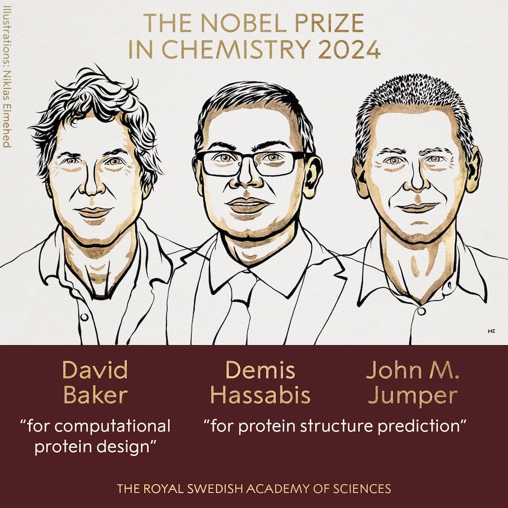

### Sources

- `corpus/AIG4B-Clase-13-IA-Bio-Quimica.md.md` — *Hasta hace poco, ciencias duras y IA estaban en mundos distintos*.
- `corpus/nobel-2024-hassabis-jumper-baker.jpg.md` — Ilustración oficial del Nobel Química 2024 (Niklas Elmehed / Royal Swedish Academy of Sciences).

### Speaker notes

Abro pidiendo a los alumnos que piensen un segundo en qué dominios cubrió la IA generativa que vimos en el curso: GPT, Stable Diffusion, agentes, vision-language. **Todos en lenguaje o píxeles.** Biología, química, física quedaron afuera por años — otro vocabulario, otras representaciones, sin dataset tipo internet del que aprender. Eso cambió. Apunto a los dos eventos: en 2020 AlphaFold 2 gana CASP14 (el torneo bianual de plegamiento) y la comunidad declara *resuelto* un problema abierto desde 1972; en 2024 el Nobel de Química se lo dan a los tres responsables del momento — Hassabis y Jumper por AlphaFold, Baker por diseño computacional de proteínas. Es la **primera vez** que el Nobel premia un trabajo cuyo método primario es una red neuronal entrenada. Las dos imágenes están acá para fijarlo: a la izquierda la ilustración oficial del comité Nobel, a la derecha el gráfico de Nature mostrando 12 años de barras grises y el salto naranja en 2020. Esa diferencia entre "promediamos 40" y "saltamos a 88" en una sola edición es lo que la clase de hoy intenta explicar. *Aviso de tono:* esto no es hype de Twitter — la IA hoy mueve drug discovery, diseño de enzimas, predicción meteorológica (GraphCast), descubrimiento de materiales (GNoME). Hoy nos ocupamos de los casos biológicos y químicos. (~2.5 min).
---

## 2. Mapa de la clase

### Content

**Primera mitad — Proteínas.** El problema del plegamiento y la evolución de AlphaFold desde 2018. Contamos los breakthroughs conceptuales, no la arquitectura.

**Segunda mitad — Química.** Cómo se representa una molécula para una red neuronal. GNNs para predecir propiedades. VAE y difusión para diseñar moléculas. **La práctica cae sobre esta mitad.**

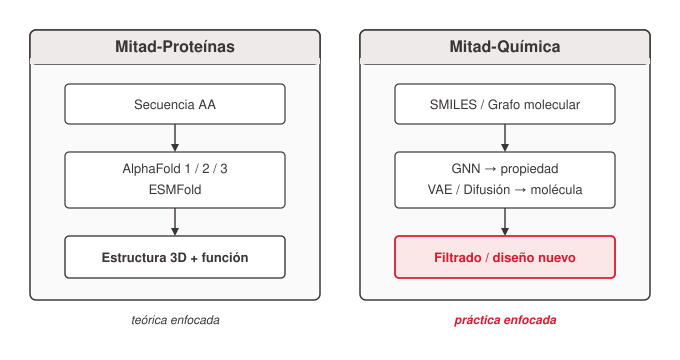
<!-- ascii-source:
+---------------------------+        +---------------------------+
|  Mitad-Proteínas          |        |  Mitad-Química            |
|                           |        |                           |
|  Secuencia AA             |        |  SMILES / Grafo molecular |
|         |                 |        |          |                |
|         v                 |        |          v                |
|  AlphaFold 1 / 2 / 3      |        |  GNN -> propiedad         |
|  ESMFold                  |        |  VAE / Difusión -> molec. |
|         |                 |        |          |                |
|         v                 |        |          v                |
|  Estructura 3D + función  |        |  Filtrado / diseño nuevo  |
+---------------------------+        +---------------------------+
        teórica enfocada                 práctica enfocada
-->
<!-- ascii-note:
intent: Two-column map of the lecture — left "Proteins" column, right "Chemistry" column. Each column flows top-down: input representation → model family → output. Footer line under each column labels which half the lecture/practice emphasizes.
emphasize: Two equal-weight parallel columns (not one nested in the other). The two output rows (structure+function vs filtering+design) carry the punchline — the eye should land on them.
labels: column headers "Mitad-Proteínas" / "Mitad-Química"; footer "teórica enfocada" / "práctica enfocada".
-->

### Sources

- `corpus/AIG4B-Clase-13-IA-Bio-Quimica.md.md` — *Mapa de la clase* (sección de bienvenida).
- `corpus/AIG4B-Clase-13-IA-Bio-Quimica-Practica-Resuelta.ipynb.md` — confirma que la práctica baja sobre la mitad-química (Ejercicio 1 GCN sobre BBBP, Ejercicio 2 VAE+difusión) + bonus ESMFold (Ejercicio 3).

### Speaker notes

Este slide es el contrato de la clase: dos mitades simétricas. Pido que lo guarden mentalmente porque va a estructurar todo lo que sigue. Mitad-proteínas (secciones 2–4 de hoy): plegamiento, evolución de AlphaFold, impacto. **No vamos a entrar en la arquitectura interna** — quedamos en breakthroughs conceptuales. Mitad-química (secciones 5–7): representaciones, GNNs, modelos generativos. *Importante:* la práctica baja sobre la mitad-química. El Ejercicio 1 es una GNN clasificando BBBP (penetración hematoencefálica); el Ejercicio 2 compara muestreo de VAE vs difusión latente; el Ejercicio 3 es un bonus con ESMFold (proteínas, como puente). Si alguien quiere mirar el notebook antes de la práctica, está en el repo del curso. (~1.5 min).
---

# 2. Plegamiento

**Goal of this section:** Establecer por qué el plegamiento de proteínas es un problema importante y por qué fue tan difícil — el setup que justifica el shock de AF2.
---

## 1. ¿Qué es una proteína?

### Content

Una proteína es una cadena lineal de **aminoácidos** (20 tipos). El cuerpo humano tiene cientos de miles distintas: enzimas, anticuerpos, receptores, hormonas, transportadores.

| Nivel | Qué es | Cómo se obtiene |
|---|---|---|
| **Secuencia** | "MKTLW...AVGI" — qué AAs y en qué orden | Secuenciación (rutina, barato) |
| **Estructura 3D** | La forma plegada en el espacio | Cristalografía / crio-EM (caro, meses) |
| **Función** | Qué hace en la célula | Experimentación biológica (años) |

🎯 **La estructura 3D determina la función.**

### Sources

- `corpus/AIG4B-Clase-13-IA-Bio-Quimica.md.md` — sección *El problema del plegamiento de proteínas*, tabla *niveles de descripción*.

### Speaker notes

Tres niveles para describir una proteína; los tres importan, pero a costos órdenes de magnitud distintos. **Secuencia**: el texto, la cadena lineal de aminoácidos. Hoy se obtiene en horas y por monedas — es lo que se llama "secuenciar". **Estructura 3D**: la forma que adopta la cadena al plegarse — esto se obtiene experimentalmente con cristalografía de rayos X o crio-microscopía electrónica, y cuesta meses (a veces años) y miles de dólares por proteína. **Función**: qué hace en la célula. Esa es biología experimental pura, años de trabajo. La oración clave del slide es la del callout: **la estructura 3D determina la función**. Dos proteínas con secuencias parecidas pero estructuras distintas hacen cosas distintas. Por eso el problema del plegamiento — predecir la 3D desde la secuencia — es tan codiciado: si lo resolvemos, saltamos del nivel barato (secuencia) al nivel valioso (función) sin pasar por el cuello de botella experimental. (~2 min).
---

## 2. Por qué importa resolverlo

### Content

Si predecimos la estructura 3D **directamente desde la secuencia**, ahorramos años y millones por problema biológico:

- 🎯 **Drug discovery** — la mayoría de los fármacos se unen a una proteína; sin 3D no se puede diseñar bien.
- 🧬 **Enfermedades genéticas** — una mutación → plegado mal → estructura explica el fallo.
- 🛠️ **Diseño de enzimas** — proteínas nuevas a medida (vacunas, biocombustibles, plásticos biodegradables).
- 🔍 **Biología básica** — muchas proteínas humanas todavía no tienen función conocida.

⚠️ **Cuello de botella histórico:** secuencias hay millones; estructuras en PDB apenas ~200.000.

### Sources

- `corpus/AIG4B-Clase-13-IA-Bio-Quimica.md.md` — sección *Por qué importa resolver el plegamiento*.

### Speaker notes

Por qué nos importa tanto el plegamiento. Cuatro aplicaciones que dan la magnitud del problema: drug discovery (la inmensa mayoría de fármacos funcionan uniéndose a una proteína — sin la 3D la búsqueda es a ciegas); enfermedades genéticas (una mutación cambia un AA, la proteína se pliega mal, eso explica por qué falla — pensar en fibrosis quística, distrofia muscular, muchas raras); diseño de enzimas (el Baker lab, que vimos en el Nobel, diseña proteínas de novo para degradar plásticos, fabricar vacunas, sensores moleculares); biología básica (cientos de miles de proteínas humanas todavía no tienen función conocida — la estructura es la primera pista). El callout del fondo es la magnitud del cuello de botella: secuencias tenemos millones, estructuras experimentales (en la PDB, el Protein Data Bank) apenas ~200.000. Las proteínas con estructura experimental son una fracción minúscula de las que existen. (~2 min).
---

## 3. 50 años de problema abierto

### Content

El plegamiento se planteó en **1972** (Anfinsen, Nobel): *"la secuencia contiene toda la información para determinar la estructura"*. En principio: predecible por computadora.

En la práctica, décadas de intentos con física, homología y heurísticas — mejoras lentas. Desde 1994 existe **CASP** (torneo bianual): predecir estructuras todavía no publicadas, comparar contra el laboratorio.

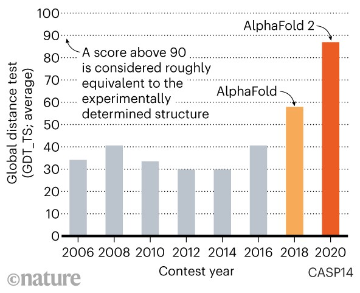

📊 **GDT_TS pre-2018: ~40. AF2 en 2020: ~88. El umbral clínico es 90.**

### Sources

- `corpus/AIG4B-Clase-13-IA-Bio-Quimica.md.md` — sección *50 años de problema abierto*.
- `corpus/casp14-gdt-ts-progression.png.md` — barras GDT_TS por edición CASP, anotación del umbral 90.

### Speaker notes

Anfinsen ganó el Nobel en 1972 demostrando que la secuencia contiene toda la información necesaria — es decir, que el problema es **resoluble en principio**. Pero "en principio" y "en la práctica" son dos cosas distintas. Décadas de intentos con física (simulaciones de dinámica molecular), homología (copiar de proteínas parecidas con estructura conocida), heurísticas de fragmentos — todas mejoraron lentamente. Desde 1994 existe CASP, un torneo bianual donde los equipos predicen estructuras de proteínas recién resueltas en el laboratorio pero todavía no publicadas. La métrica es GDT_TS: porcentaje de átomos correctamente posicionados respecto a la verdad experimental. La imagen es la barra histórica: 12 años de barras grises entre 30 y 41, casi estancado. Y después llega 2018 con AF1 (la barra naranja claro, ~58 — primer escalón) y 2020 con AF2 (la barra naranja oscuro, ~88). La anotación del gráfico señala que **un GDT_TS por encima de 90 es equivalente a la estructura experimental** — esa línea es donde "predicción" deja de ser "aproximación" y se vuelve "verdad". AF2 cruzó esa línea en mediana. La comunidad declaró *solved*. (~2.5 min).
---

# 3. AlphaFold

**Goal of this section:** Contar la evolución conceptual AF1 → AF2 → ESMFold → AF3 enfatizando *qué cambió en cada salto* sin entrar en arquitectura interna, y cerrar con el Nobel 2024 como sello formal.
---

## 1. AlphaFold 1 (2018)

### Content

DeepMind aparece en CASP13 con un enfoque distinto: **una red neuronal** en vez de simulación física.

CNN predice un **mapa de distancias 2D** (matriz de cuán cerca está cada par de AAs) → reconstrucción geométrica clásica → estructura 3D.

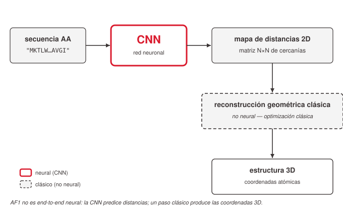
<!-- ascii-source:
                +----------------+
secuencia AA -->|      CNN       |--> mapa de distancias 2D
"MKTLW...AVGI"  +----------------+    (matriz NxN de cercanías)
                                                 |
                                                 v
                                      reconstrucción geométrica
                                            clásica
                                                 |
                                                 v
                                          estructura 3D
-->
<!-- ascii-note:
intent: Pipeline AF1 — secuencia entra a una CNN, sale un mapa 2D de distancias, después un paso clásico (no neural) lo convierte a coordenadas 3D. La separación entre "CNN" y "reconstrucción clásica" es el mensaje central — AF1 no era end-to-end neural.
emphasize: La caja CNN (recuadro grueso) y la frase "reconstrucción geométrica clásica" (señalar que no es neural).
labels: input "secuencia AA", intermedio "mapa de distancias 2D (matriz NxN)", paso "reconstrucción geométrica clásica", output "estructura 3D".
-->

✅ Gana CASP13 con margen claro. ❌ **No resuelve** el problema — GDT_TS sube, pero sigue lejos de la utilidad clínica.

### Sources

- `corpus/AIG4B-Clase-13-IA-Bio-Quimica.md.md` — sección *AlphaFold 1 (2018) — entra deep learning al problema*.

### Speaker notes

AF1 es el primer salto pero **no es el momento de la solución**. DeepMind aparece en CASP13 con algo distinto: en vez de simular física, una red neuronal. Específicamente, una CNN que recibe la secuencia y predice un mapa de distancias 2D — una matriz NxN donde cada entrada dice cuán cerca están en 3D el aminoácido i y el aminoácido j. Eso es **un sub-producto** de la estructura 3D, no la estructura misma. Para llegar a las coordenadas, AF1 todavía usa un paso clásico de optimización geométrica encima. Es decir, **no es end-to-end neural**. Resultado: gana CASP13 (la barra naranja claro del gráfico anterior, ~58) — un salto sobre lo histórico, pero todavía lejos del umbral 90. El verdadero breakthrough conceptual de AF1 no es el número — es la **demostración de que el plegamiento se puede atacar con redes neuronales**. Cambió el ánimo de la comunidad: ya no era *si* el deep learning iba a entrar, era *cuándo*. (~2 min).
---

## 2. AlphaFold 2 (2020) — el salto

### Content

CASP14: AF2 **resuelve** el plegamiento. GDT_TS ~92, histórico ~40.

Tres ideas conceptuales clave — sin entrar en la arquitectura:

1. 🧬 **Información evolutiva profunda (MSA).** Posiciones que mutan juntas en la evolución suelen estar cerca en 3D.
2. 🔁 **Refinamiento iterativo de dos representaciones** en paralelo (secuencia + relaciones por pares), actualizadas alternadamente.
3. 📐 **Salida geométrica con simetrías físicas** — predice geometrías locales respetando rotaciones/traslaciones.

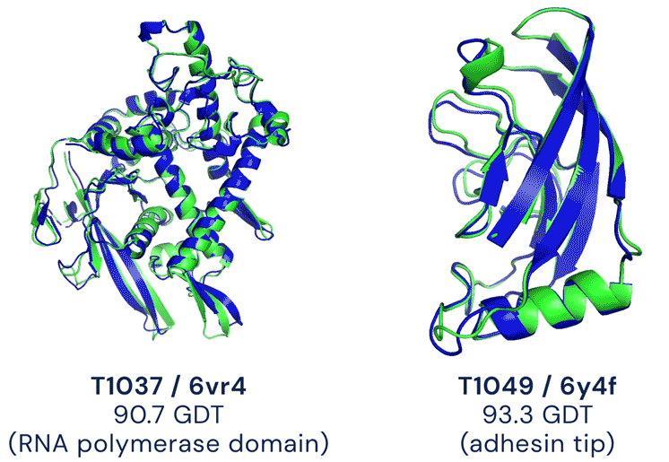

### Sources

- `corpus/AIG4B-Clase-13-IA-Bio-Quimica.md.md` — sección *AlphaFold 2 (2020) — el salto*.
- `corpus/af2-vs-experimental-3d-overlay.png.md` — T1037/6vr4 (90.7 GDT, RNA polymerase domain) + T1049/6y4f (93.3 GDT, adhesin tip).

### Speaker notes

CASP14, 2020. DeepMind vuelve con AF2 y la comunidad colectivamente concluye que el problema está resuelto. GDT_TS promedio ~92 — la cifra exacta varía (mediana 92.4, promedio 88 según fuente), pero todas cruzan el umbral 90. Tres ideas conceptuales explican el salto — **sin meternos en la arquitectura interna**, que es densa. Uno: información evolutiva profunda vía MSA, multiple sequence alignment. El modelo no recibe solo la secuencia que querés predecir; recibe un alineamiento de proteínas evolutivamente relacionadas. La intuición clave: las posiciones que mutan juntas a lo largo de la evolución (cuando un AA cambia, otro también cambia en cierta posición compensatoria) suelen estar **cerca en el espacio 3D**. Información estructural escondida en la historia evolutiva. Dos: refinamiento iterativo de dos representaciones — el modelo mantiene en paralelo la vista de la secuencia y la vista de las relaciones por pares de residuos, y las actualiza alternadamente, cada una informando a la otra. La estructura emerge de ese diálogo. Tres: salida con simetrías físicas — no predice coordenadas crudas, predice geometrías locales (rotaciones y traslaciones de cada residuo). Le saca al modelo el trabajo de "aprender" cosas que la física ya sabe. La imagen del lado derecho muestra el resultado: dos targets reales de CASP14, predicción AF2 en azul, estructura experimental en verde, prácticamente indistinguibles. T1037 (un dominio de RNA polimerasa) con GDT 90.7, T1049 (la punta de una adhesina bacteriana) con 93.3. Dos folds estructuralmente distintos — uno alfa-beta mixto, uno beta-sandwich — y AF2 acierta los dos. (~3 min).
---

## 3. ESMFold (2022)

### Content

El MSA es caro: hay que buscar y alinear millones de secuencias por proteína (minutos por consulta).

Meta entrena **ESM-2**, un LLM de proteínas (~15B params, 200M secuencias, sin estructuras). **ESMFold = ESM-2 + cabeza estructural**.

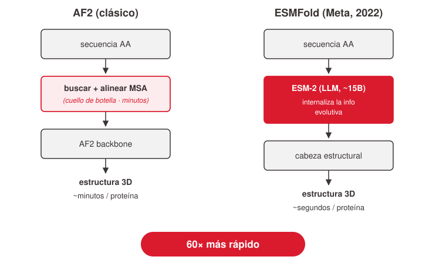
<!-- ascii-source:
   AF2 (clásico)                 ESMFold (Meta, 2022)
+------------------+         +----------------------+
| secuencia AA     |         | secuencia AA         |
+--------+---------+         +----------+-----------+
         |                              |
         v                              v
+------------------+         +----------------------+
| buscar + alinear |         |  ESM-2 (LLM, 15B)    |
|   MSA (minutos)  |         |  internaliza la      |
+--------+---------+         |  info evolutiva      |
         |                   +----------+-----------+
         v                              |
+------------------+                    v
|   AF2 backbone   |         +----------------------+
+--------+---------+         |  cabeza estructural  |
         |                   +----------+-----------+
         v                              |
   estructura 3D                        v
   ~minutos / proteína              estructura 3D
                                 ~segundos / proteína
                                    (60x más rápido)
-->
<!-- ascii-note:
intent: Side-by-side comparison AF2 vs ESMFold. Both take a sequence and emit a 3D structure. AF2's left column has an extra slow step (MSA search/align). ESMFold's right column replaces it with an LLM that internalized the evolutionary signal during pre-training. Footer shows the speed delta — minutes vs seconds.
emphasize: The MSA step on the left (the bottleneck AF2 has) and the LLM box on the right (the bottleneck ESMFold eliminated). The "60x más rápido" footer is the punchline.
labels: column headers "AF2 (clásico)" / "ESMFold (Meta, 2022)"; footers "~minutos / proteína" / "~segundos / proteína (60x más rápido)".
-->

🎯 **Breakthrough:** la info evolutiva no necesita venir explícita en un alineamiento — puede vivir *internalizada en un LLM*.

### Sources

- `corpus/AIG4B-Clase-13-IA-Bio-Quimica.md.md` — sección *ESMFold (2022) — ¿hace falta el MSA?*.
- `corpus/AIG4B-Clase-13-IA-Bio-Quimica-Practica-Resuelta.ipynb.md` — el Ejercicio 3 corre ESMFold local en clase (cells 37–46).

### Speaker notes

ESMFold (Meta AI, 2022) ataca el cuello de botella de AF2 sin tocar la precisión. El cuello es el MSA: para cada proteína que querés predecir, hay que buscar en bases de millones de secuencias todas las proteínas relacionadas, alinearlas — eso tarda minutos por consulta. Es lento y depende de tener bases de homologías ricas; para proteínas raras no funciona. La idea de Meta: entrenar un LLM gigante de proteínas, **ESM-2**, sobre 200 millones de secuencias con la tarea de predecir el próximo aminoácido (sin estructura, sin MSA, solo secuencias). El modelo termina con ~15.000 millones de parámetros y aprende **internamente** las regularidades evolutivas — las correlaciones de coevolución que el MSA captura explícitamente. Después le ponen una cabeza estructural arriba (eso es ESMFold) y predice estructura directamente, sin pasar por el MSA. Resultado: precisión cercana a AF2, **~60 veces más rápido**. El breakthrough conceptual es importante: la información evolutiva no tiene que entrar explícita; puede vivir **dentro de los pesos de un LLM** entrenado masivamente. Esto es exactamente lo que harán en el **Ejercicio 3** de la práctica de hoy — bajan ESMFold de HuggingFace, le tiran tres proteínas y miran las estructuras predichas + las confidencias. Es el bonus que cierra la mitad-proteínas. (~2.5 min).
---

## 4. AlphaFold 3 (2024)

### Content

AF2 predice **proteínas solas**. En biología real, una proteína casi nunca está sola: interactúa con drogas, ADN, ARN, otras proteínas, iones. Lo que importa clínicamente es el **complejo**.

AF3 generaliza: una arquitectura para cualquier combinación proteína + ligando + ácido nucleico + ión. **El módulo final es difusión** — el mismo paradigma de Stable Diffusion (Clase 9), aplicado a coordenadas 3D.

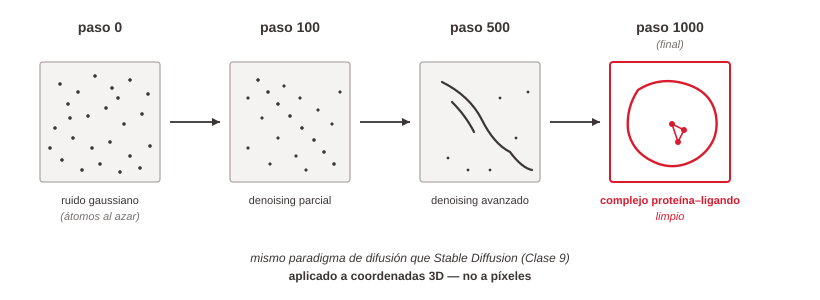
<!-- ascii-source:
  paso 0          paso 100         paso 500         paso 1000
                                                  (final)
  +---+           +---+            +---+            +---+
  |...|           | . |            | / |            |/--\|
  |. .|   --->    |/.|     --->    |/-.|    --->    |/  \|
  |...|           |.\|             |. \|            |\  /|
  +---+           +---+            +---+            +---+
   ruido         denoising         denoising      complejo
   gaussiano      parcial           avanzado     proteína-ligando
   (atomos                                          limpio
   al azar)
-->
<!-- ascii-note:
intent: Diffusion denoising trajectory — start with random atom positions (Gaussian noise), iteratively denoise, end with a clean 3D complex. Mirror of the Stable Diffusion teaching diagram from Clase 9, applied here to atomic coordinates instead of pixel values.
emphasize: The progression left-to-right from clearly random to clearly structured. The shape inside each box should hint at "atoms" not "pixels" — small dots/strokes resolving into a folded form.
labels: column headers "paso 0" / "paso 100" / "paso 500" / "paso 1000 (final)"; footer captions "ruido gaussiano (átomos al azar)" / "denoising parcial" / "denoising avanzado" / "complejo proteína-ligando limpio".
-->

🎯 **Breakthrough:** el mismo paradigma de difusión que usamos para imágenes (Clase 9) sirve para estructuras moleculares 3D. Cambia el dominio, no el método.

### Sources

- `corpus/AIG4B-Clase-13-IA-Bio-Quimica.md.md` — sección *AlphaFold 3 (2024) — generalización con difusión*.

### Speaker notes

AF3, 2024, es la generalización. El problema de AF2 era que predecía proteínas solas — útil para investigación, limitado para clínica. En la realidad, una proteína casi nunca está sola: una droga (ligando pequeño) entra y se une, un transcription factor se pega al ADN, dos cadenas de hemoglobina forman un dímero, hay iones esenciales para la función catalítica. **Lo que importa clínicamente es el complejo**, no el monómero. AF3 ataca eso de frente: una sola arquitectura que predice estructuras de cualquier combinación de proteínas + ligandos + ácidos nucleicos + iones. El cambio técnico clave para nosotros es **el módulo final**: en AF2 era un módulo geométrico de cabeza propia; en AF3 es un **modelo de difusión**. Diffusion-based — el mismo paradigma de Stable Diffusion que vimos en la **Clase 9**. Genera coordenadas 3D iterativamente, partiendo de ruido gaussiano sobre las posiciones atómicas y limpiándolo paso a paso. El diagrama del slide es exactamente eso, aplicado a moléculas en vez de píxeles. El punto conceptual es importantísimo para el resto de la clase: **la difusión no es un truco de imágenes**. Es una arquitectura general para generar datos estructurados de alta dimensión. Cuando lleguemos a la sección de generación de moléculas vamos a ver la misma idea otra vez, ahora sobre SMILES. (~3 min).
---

## 5. Nobel 2024

### Content

- **Hassabis + Jumper** (DeepMind) — *"for protein structure prediction"* (AlphaFold).
- **Baker** (UW) — *"for computational protein design"* (proteínas de novo).

🎯 **Primera vez** que el Nobel premia un trabajo cuyo método principal es una red neuronal entrenada. La IA dejó de ser herramienta auxiliar — es *el método* en biología estructural.

### Sources

- `corpus/AIG4B-Clase-13-IA-Bio-Quimica.md.md` — sección *Nobel de Química 2024*.
- `corpus/nobel-2024-hassabis-jumper-baker.jpg.md` — ilustración oficial Niklas Elmehed, citas oficiales del comité.

### Speaker notes

Cierre formal de esta sección. Octubre 2024, Nobel de Química. La mitad para Hassabis + Jumper *for protein structure prediction* — AlphaFold. La otra mitad para Baker *for computational protein design* — el otro lado del problema, generar proteínas nuevas con función deseada. Los tres en la misma foto del slide. Dos cosas para que se lleven. Una: **primera vez** que el Nobel — el premio más conservador de la ciencia, que históricamente toma 20 años en reconocer un descubrimiento — premia un método cuyo núcleo es una red neuronal entrenada. No es un experimento ayudado por IA; es un **método cuya formulación primaria es la red**. Eso marca un cambio de era institucionalmente. Dos: el premio reconoce **los dos lados del problema simultáneamente** — predicción (DeepMind) y diseño (Baker). Eso es lo que da sentido a las dos mitades de esta clase. La mitad-química que sigue es exactamente lo análogo a lo que hizo Baker, pero sobre moléculas pequeñas en vez de proteínas. (~2 min).
---

# 4. Impacto y recursos

**Goal of this section:** Mostrar qué cambió *concretamente* en el día a día de la biología después de AF2 (la base de datos abierta y las aplicaciones en producción), y ser honestos sobre los límites.
---

## 1. AlphaFold DB — antes vs después

### Content

DeepMind + EMBL-EBI corrieron AF2 sobre prácticamente toda UniProt. Resultado público y libre: **AlphaFold DB** (`alphafold.ebi.ac.uk`).

| Antes (2020) | Después (AlphaFold DB) |
|---|---|
| ~200.000 estructuras experimentales (PDB) | ~200.000.000 estructuras predichas |
| Décadas de cristalografía | Predicciones en horas |
| Solo proteínas "interesantes" | Cualquier proteína en UniProt |

📊 **1000× más estructuras disponibles.** Pasó de un recurso curado a un commodity.

### Sources

- `corpus/AIG4B-Clase-13-IA-Bio-Quimica.md.md` — sección *AlphaFold DB: 200 millones de estructuras, libres*.

### Speaker notes

Impacto inmediato y verificable. Después de AF2, DeepMind se asoció con EMBL-EBI (el European Bioinformatics Institute) y corrió AF2 sobre prácticamente todo UniProt — la base universal de secuencias proteicas. El resultado se llama **AlphaFold Protein Structure Database**, está abierta a todo el mundo en `alphafold.ebi.ac.uk`. La tabla es el contraste de magnitud: antes de 2020, después de 50 años de cristalografía y crio-EM, la PDB tenía ~200.000 estructuras experimentales. Después de AF2, hay 1000× más estructuras *predichas*. Cualquier investigador del mundo entra a la base, busca su proteína, y se la descarga. El cambio es categórico — la estructura proteica pasó de ser un recurso curado y escaso a ser **un commodity al alcance de cualquiera**. Cómo es lo que ven cuando entran a la base: en el próximo slide. (~2 min).
---

## 2. Render por confianza

### Content

Cada predicción viene con un **mapa de confianza per-residuo (pLDDT)** — no un número global, un valor por aminoácido.

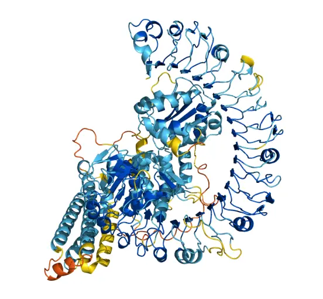

📊 **Color = pLDDT:** azul oscuro >90 (alta), celeste 70–90, amarillo 50–70, naranja <50 (baja — típico de regiones flexibles o intrínsecamente desordenadas).

### Sources

- `corpus/AIG4B-Clase-13-IA-Bio-Quimica.md.md` — sección *AlphaFold DB: 200 millones de estructuras, libres*.
- `corpus/alphafold-db-protein-Q8W3K0.webp.md` — render canónico de AlphaFold DB, gradiente pLDDT.

### Speaker notes

La presentación canónica de la base. Render cartoon de una proteína de ~600 AAs, coloreada por **pLDDT** (predicted Local Distance Difference Test). pLDDT es la métrica de confianza per-residuo que AF2 emite junto con cada estructura: en lugar de devolver un único número global "esta predicción es X% confiable", devuelve un **mapa por aminoácido**. Eso es importante porque las proteínas reales no son homogéneas en su predictibilidad. El gradiente del slide va: azul oscuro = pLDDT > 90, muy confiable (mismo orden de magnitud que la cristalografía); celeste = 70–90, alta; amarillo = 50–70, baja; naranja/rojo = < 50, muy baja. Lo que vemos en la imagen: el **core es azul** (las hélices y láminas plegadas — confiables); las **colas y loops salientes son naranjas** (regiones flexibles o intrínsecamente desordenadas, donde el modelo se reconoce inseguro). Quédense con esto: cuando consulten AlphaFold DB para su propio trabajo, **siempre mirar el pLDDT** antes de creer una región. Las cosas naranjas son sospechosas y muchas veces son las más interesantes biológicamente — los loops flexibles que median interacciones. (~2 min).
---

## 3. Aplicaciones en producción

### Content

- 💊 **Drug discovery** — identificar binding sites en proteínas humanas y patógenos, filtrar candidatos antes de síntesis.
- 🛠️ **Diseño de enzimas (Baker lab)** — proteínas de novo: enzimas para degradar plásticos, vacunas estructuralmente diseñadas, sensores moleculares.
- 🛡️ **Anticuerpos terapéuticos** — modelar la interacción anticuerpo-antígeno antes del laboratorio.
- 🧬 **Enfermedades raras** — explicar cómo una mutación desestabiliza la proteína de un paciente.

⚠️ **No reemplaza el experimento.** Filtra y prioriza: en vez de probar miles a ciegas, probar decenas con justificación estructural.

### Sources

- `corpus/AIG4B-Clase-13-IA-Bio-Quimica.md.md` — sección *Aplicaciones que ya están en producción*.

### Speaker notes

Cuatro categorías concretas donde AF2 / AF3 ya están en pipelines reales — no en papers, en producción. Drug discovery: la mayor parte de los fármacos modernos funcionan uniéndose a un bolsillo (binding site) de una proteína; AF2 ayuda a identificar esos bolsillos en proteínas humanas y de patógenos, y a filtrar candidatos antes de gastar plata sintetizándolos. Diseño de enzimas: el Baker lab usa una pila que incluye AF + RFdiffusion + métodos clásicos para diseñar **proteínas que no existen en la naturaleza**, con función deseada — enzimas que degradan PET (plástico), vacunas estructuralmente diseñadas, sensores moleculares. Anticuerpos terapéuticos: modelar la interacción anticuerpo-antígeno *in silico* antes de cualquier síntesis. Enfermedades raras: cuando un paciente tiene una mutación rara, AF puede mostrar cómo esa mutación cambia la estructura — eso explica por qué falla y a veces sugiere terapia. **Disclaimer importante:** ninguno de estos casos *reemplaza* el experimento de laboratorio. La IA filtra y prioriza — en vez de probar miles de candidatos a ciegas, se prueban decenas con justificación estructural. El valor está en el embudo, no en saltarse el wet lab. (~2 min).
---

## 4. Limitaciones honestas

### Content

AlphaFold predice **una estructura estática promedio**. Eso deja afuera varias cosas que importan:

- 🔁 **Dinámica conformacional** — las proteínas se mueven, abren/cierran bolsillos. AF da foto, no video.
- 🧬 **Mutaciones puntuales** — efecto fino de un AA cambiado muchas veces por debajo de la resolución del modelo.
- 🌡️ **Condiciones fisiológicas** — AF no sabe nada de pH, temperatura, iones, entorno celular.
- 〰️ **Proteínas intrínsecamente desordenadas** — no tienen estructura plegada estable. AF no las representa bien.

✅ **Conclusión clínica:** AlphaFold es un punto de partida fantástico, no una respuesta final.

### Sources

- `corpus/AIG4B-Clase-13-IA-Bio-Quimica.md.md` — sección *Limitaciones honestas*.

### Speaker notes

Honestidad intelectual — no todo es triunfalismo. AlphaFold devuelve **una estructura estática promedio**, y la biología real no funciona así. Cuatro limitaciones importantes que cualquier alumno que vaya a publicar usando AF debería conocer. Dinámica conformacional: las proteínas reales no están plantadas en una pose; se mueven, abren y cierran bolsillos, cambian de forma según con qué interactúan. AF da una **foto**, no un video. Importa para drug discovery porque a veces el binding site solo aparece en una conformación específica. Mutaciones puntuales: en enfermedades genéticas, una sola mutación de AA puede romper la función — pero el efecto sobre la estructura suele ser sutil, debajo de la resolución del modelo. Decir "esta mutación rompe esta proteína" usando AF requiere mucho cuidado. Condiciones fisiológicas: AF no sabe nada de pH, temperatura, concentración iónica ni del entorno celular real. La estructura que devuelve es agnóstica del contexto. Proteínas intrínsecamente desordenadas: hay una categoría importante de proteínas que **no tienen** estructura plegada estable — están desordenadas por diseño (muchas señalizadoras, IDPs). AF las modela como si tuvieran estructura, y eso es un error categórico. La conclusión es la del callout: punto de partida fantástico, no respuesta final. (~2.5 min).
---

# 5. Representaciones

**Goal of this section:** Hacer la transición a la mitad-química explicando que **antes de hacer ML sobre moléculas hay que decidir cómo representarlas**, y dar los tres estándares con sus trade-offs.
---

## 1. Tres formas de representar

### Content

Antes de IA sobre moléculas, hay que decidir cómo se las damos a la red. Tres estándares — misma molécula, tres formas:

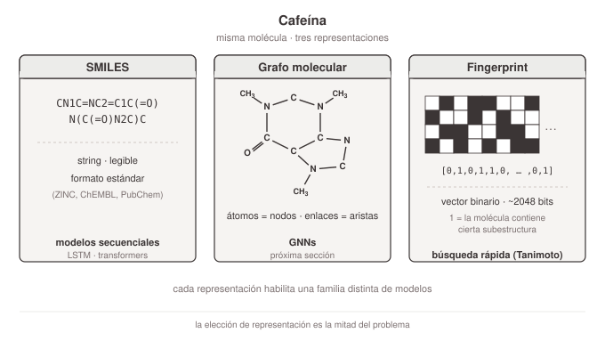
<!-- ascii-source:
        Cafeína
+------------------------+   +------------------------+   +------------------------+
|       SMILES           |   |    Grafo molecular     |   |     Fingerprint        |
|                        |   |                        |   |                        |
| CN1C=NC2=C1C(=O)       |   |       N---C--N         |   | [0,1,0,1,1,0,...,0,1]  |
| N(C(=O)N2C)C           |   |      /|       \\        |   |                        |
|                        |   |     C |        N        |   |   ~2048 bits           |
|  string, legible       |   |     | C---C---/        |   |                        |
|  formato estándar      |   |     N |   |             |   |  binario fijo:         |
|  (ZINC, ChEMBL)        |   |     | C===O             |   |  1 = la molécula       |
|                        |   |     C                   |   |      contiene cierta   |
|                        |   |     |                   |   |      subestructura     |
|                        |   |     CH3 ...             |   |                        |
+------------------------+   +------------------------+   +------------------------+
   modelos secuenciales         GNNs (próxima sección)      búsqueda rápida
   (LSTM, transformers)                                     (Tanimoto)
-->
<!-- ascii-note:
intent: Three representations of caffeine side by side: SMILES (textual string), molecular graph (atoms+bonds), fingerprint (binary vector). Each panel includes a one-line description of what kind of model consumes it.
emphasize: The three boxes are equal-weight peers — no hierarchy. The bottom captions are the "what consumes this" map that the next sections will pick up.
labels: panel titles "SMILES" / "Grafo molecular" / "Fingerprint"; bottom captions "modelos secuenciales" / "GNNs (próxima sección)" / "búsqueda rápida (Tanimoto)".
-->

### Sources

- `corpus/AIG4B-Clase-13-IA-Bio-Quimica.md.md` — sección *Cómo representamos moléculas*, tabla *Tres formas*.

### Speaker notes

Transición clave de la clase: dejamos las proteínas, entramos a la química. Y la primera pregunta que aparece, antes de hablar de cualquier modelo, es: **cómo le doy una molécula a una red neuronal**. No hay una respuesta única — hay tres estándares, cada uno bueno para algo distinto, y la elección de representación es **la mitad del problema** (vamos a volver sobre esto en el cierre). El slide muestra la cafeína en las tres formas. Una: **SMILES** — Simplified Molecular-Input Line-Entry System. Es un string de texto que codifica la molécula siguiendo una gramática. Para la cafeína es `CN1C=NC2=C1C(=O)N(C(=O)N2C)C`. Compacto, legible, formato estándar para distribuir datasets (ZINC, ChEMBL, PubChem). Como input de red neuronal, sirve para modelos secuenciales — LSTMs, transformers. Dos: **grafo molecular** — los átomos son nodos, los enlaces son aristas. Capta la estructura tal como es, sin ambigüedad de notación. Es el input natural para las **GNNs**, que es lo que vamos a ver en la próxima sección. Tres: **fingerprint** — un vector binario fijo (~2048 bits) donde cada bit dice "¿la molécula contiene tal subestructura?". Es rápido y fácil de comparar (similitud de Tanimoto entre dos moléculas = % de bits compartidos). Era el caballito de batalla del drug discovery clásico, antes de las redes neuronales. (~3 min).
---

## 2. Cuándo usar cada una

### Content

| Representación | Fuerte en | Limitación | Modelo típico |
|---|---|---|---|
| **SMILES** | Distribución de datos, generación autoregresiva | No canónico — misma molécula admite varias formas | LSTM, transformer, VAE de SMILES |
| **Grafo** | Estructura sin ambigüedad, simetrías explícitas | Más caro de procesar | **GNN (GCN, GIN, MPNN)** |
| **Fingerprint** | Búsqueda rápida en bases gigantes (Tanimoto) | Vector fijo — no se adapta al problema | Random forest, SVM, kNN |

🎯 **En la práctica de hoy:** Ej. 1 usa **grafos** (GCN sobre BBBP); Ej. 2 usa **SMILES** (in/out del VAE).

### Sources

- `corpus/AIG4B-Clase-13-IA-Bio-Quimica.md.md` — sección *Cuándo usar cada una*.
- `corpus/AIG4B-Clase-13-IA-Bio-Quimica-Practica-Resuelta.ipynb.md` — Ej. 1 (cells 9–17): featurización SMILES→grafo; Ej. 2 (cells 19–35): VAE sobre SMILES.

### Speaker notes

Tabla de cuándo elegir cada representación. SMILES: bueno para distribuir datos (los datasets vienen en formato SMILES por defecto) y para generación autoregresiva (un modelo aprende a generar el string carácter a carácter, exactamente como un LLM genera texto). Limitación importante: SMILES **no es canónico** por defecto — la misma molécula admite varias formas válidas (depende de por qué átomo empezás a escribirla). Eso le pone trabajo extra a cualquier modelo que la procese. Hay versiones canonicalizadas (RDKit tiene una función), pero todavía hay edge cases. Grafo: la representación correcta cuando el problema depende de la **estructura local**. Sin ambigüedad de notación, las simetrías son explícitas. Es lo que las GNNs consumen — vamos a ver cómo en un minuto. Más caro de procesar que un string. Fingerprint: vector binario fijo, ~2048 bits. La virtud es la velocidad para **búsqueda rápida** en bases gigantes: para comparar 10 millones de moléculas, Tanimoto es órdenes de magnitud más rápido que GNNs. Limitación: el vector es predefinido, no se adapta al problema — pierde flexibilidad. **Para la práctica de hoy:** en el Ejercicio 1 usamos grafos (GCN sobre BBBP), en el Ejercicio 2 usamos SMILES (entrada y salida del VAE). Quédense con eso y vamos al siguiente bloque. (~2.5 min).
---

# 6. GNNs

**Goal of this section:** Construir intuición sobre cómo funciona una GNN (message passing), nombrar las variantes principales sin entrar en matemática, y montar el setup directo del Ejercicio 1.
---

## 1. Message passing

### Content

Una **GNN** opera sobre grafos. La operación básica es **message passing**:

> Cada nodo (átomo) actualiza su representación combinando información de sus vecinos.

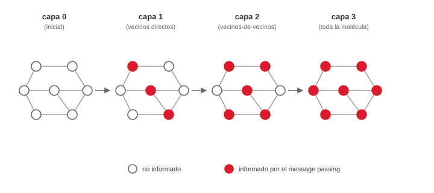
<!-- ascii-source:
  capa 0                  capa 1                  capa 2                  capa 3
  (inicial)         (vecinos directos)      (vecinos-de-vecinos)        (toda la
                                                                      molécula)

    o---o                 *---o                 *---*                 *---*
   /     \\               / \   \\              /\   \\              /\\\   \\
  o       o-o    ->     o   * -*o    ->     o-* *-*o    ->       *-*-*-*o
   \\     /              \\   \\ /             \\\\\ \\ /            \\\\\ \\\\/
    o---o                 o---*                 *---*                 *---*

  o = no informado          *  = informado por el message passing
-->
<!-- ascii-note:
intent: Show information propagation across k layers of message passing on a fixed molecular graph (~7 nodes). At layer 0 nothing is "informed". At each next layer, more nodes become informed (marked with *). After k layers, every node "knows about" everything within k hops.
emphasize: The visual progression — sparse * → dense * → fully * across the four columns. Use the asterisk vs circle convention so it's obvious what changed each step.
labels: column headers "capa 0 (inicial)" / "capa 1 (vecinos directos)" / "capa 2 (vecinos-de-vecinos)" / "capa 3 (toda la molécula)"; legend "o = no informado, * = informado".
-->

Al final: **pooling global** (suma/promedio) → MLP → propiedad predicha.

### Sources

- `corpus/AIG4B-Clase-13-IA-Bio-Quimica.md.md` — sección *Message passing: la idea central*.

### Speaker notes

Cómo funciona una GNN — sin matemática, con intuición. La operación básica se llama **message passing** y es muy simple: cada nodo (en moléculas, cada átomo) actualiza su representación combinando información de sus vecinos directos. Después de **1 capa** de message passing, cada átomo sabe sobre sí mismo y sobre sus vecinos directos. Después de **2 capas**, sabe sobre sus vecinos-de-vecinos. Después de **k capas**, sabe sobre todo lo que está a distancia k en el grafo. El diagrama del slide es exactamente eso: empezamos con cada átomo "no informado" (los círculos), y a medida que aplicamos capas, el "asterisco" — la información acumulada — se va propagando. Después de 3 o 4 capas, toda la molécula está conectada en cada representación de átomo. Una vez que tenemos buenos vectores por átomo, los **agregamos** en un único vector con pooling global (suma o promedio sobre todos los átomos), y le tiramos un MLP encima que predice la propiedad final (en nuestro caso: ¿esta molécula cruza la BBB o no?). **Por qué funciona en moléculas:** las propiedades químicas dependen del entorno local — qué grupos funcionales hay, qué subestructuras aparecen. Eso es exactamente lo que el message passing captura. (~3 min).
---

## 2. Una convolución parametrizada

### Content

Una **capa de GNN** = aplicar la siguiente operación a **cada nodo en paralelo**. Para el nodo `v` con vecinos `N(v)`:

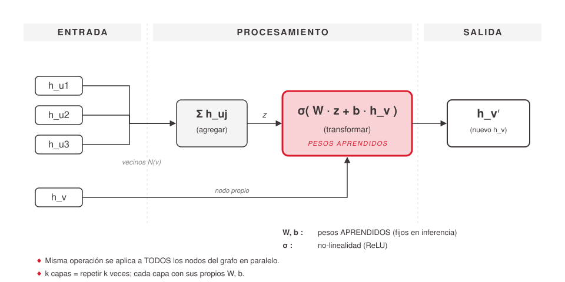
<!-- ascii-source:
   ENTRADA                        PROCESAMIENTO                              SALIDA

   h_u1  ┐
         │
   h_u2  ┼──►  ┌────────────┐    ┌──────────────────────┐    ┌─────────────┐
         │     │   Σ h_uj   │──►│  σ( W · z + b · h_v )  │──►│    h_v'     │
   h_u3  ┘     │ (agregar)  │    │   (transformar)       │    │ (nuevo h_v) │
               └────────────┘    └──────────────────────┘    └─────────────┘
   h_v   ────────────────────────────────────┘
                       z

                                   W, b : pesos APRENDIDOS  (fijos en inferencia)
                                   σ    : no-linealidad (ReLU)

   ◆ Misma operación se aplica a TODOS los nodos del grafo en paralelo.
   ◆ k capas = repetir k veces; cada capa con sus propios W, b.
-->
<!-- ascii-note:
intent: Abstract flow diagram of ONE parameterized graph-convolution layer for a focal node v. Three neighbor feature vectors (h_u1, h_u2, h_u3) enter, get aggregated (sum), then pass through a learned linear transform (W·z + b·h_v) and a nonlinearity (σ) to produce the updated feature vector h_v'. The takeaway is the discipline: weights W and b are LEARNED during training and FIXED at inference; the operation is applied in parallel across the whole graph; k layers = k repetitions with independent weights.
emphasize: The transformation box (σ(W·z + b·h_v)) is the load-bearing element — it's where the learned weights live. The "pesos APRENDIDOS, fijos en inferencia" annotation is the conceptual takeaway. The output h_v' should pop visually.
labels: stage banner along top "ENTRADA / PROCESAMIENTO / SALIDA"; box contents "Σ h_uj (agregar)", "σ( W · z + b · h_v ) (transformar)", "h_v' (nuevo h_v)"; bottom annotations "W, b: pesos APRENDIDOS (fijos en inferencia)" and "σ: no-linealidad (ReLU)"; two closing bullets about parallelism and k layers.
-->

📖 **Para más profundidad:** *A Gentle Introduction to Graph Neural Networks* — Daigavane, Ravindran, Aggarwal (Distill, 2021). [`distill.pub/2021/understanding-gnns`](https://distill.pub/2021/understanding-gnns). Visualizaciones interactivas + álgebra paso a paso.

### Sources

- `corpus/AIG4B-Clase-13-IA-Bio-Quimica.md.md` — secciones *Message passing* y *GCN, GIN, MPNN — variantes del mismo patrón*.
- Daigavane, A., Ravindran, B., Aggarwal, G. (2021) — *Understanding Convolutions on Graphs*, Distill.

### Speaker notes

Acá zoomeamos sobre **qué hace UNA capa para UN nodo**. La intuición de message passing del slide anterior es "el nodo combina info de sus vecinos" — esto es la operación **concreta** detrás. Para el nodo `v` con 3 vecinos (en este ejemplo; en una molécula real cada átomo tiene 1–4 vecinos según la valencia):

**Paso 1 — Agregar.** Sumamos las representaciones de los vecinos elemento-a-elemento: `z = Σ h_uj`. Algunas variantes usan promedio (GCN normaliza por grado), suma (GIN), o atención (GAT) — la idea es condensar la información del vecindario en un único vector.

**Paso 2 — Transformar.** Aplicamos una transformación lineal **aprendida** `W·z` (donde `W` es típicamente una matriz 64×64 si los `h` son de 64-D), le sumamos un término del nodo propio `b·h_v` (para que `v` no se "olvide" de sí mismo), y le pasamos una no-linealidad `σ` (ReLU). El resultado es `h_v' = σ(W·z + b·h_v)`.

**Paso 3 — Salida.** `h_v'` es la nueva representación de `v` — incorpora información del vecindario. Pasa a la siguiente capa, o si era la última, al pooling global.

**Lo crítico — la diferencia training vs inferencia.** `W` y `b` son **aprendidos** durante el training loop (backprop sobre BBBP en nuestro caso). Durante inferencia están **fijos**: el modelo ya entrenado aplica esta operación tal cual está. No hay aprendizaje en el momento de la predicción.

**Lo que NO se ve en el diagrama** (pero está pasando en paralelo): la **misma operación** se aplica a **todos los nodos del grafo a la vez** — no es secuencial. Una capa de GNN es **una matriz de operaciones** sobre todos los nodos. **k capas** = k pasos de message passing, cada uno con su propio `W` y `b` (cada capa tiene parámetros independientes).

Si quieren ir más profundo en la matemática (cómo se deriva GCN como una *convolución* en el sentido espectral, qué hace exactamente la normalización por grado en GCN, por qué GIN es más expresivo, etc.), el artículo de Distill que cito al pie es excelente: visualizaciones interactivas + álgebra paso a paso, pensado para alumnos avanzados de undergrad. *Distill* en general es una buena fuente de artículos didácticos sobre deep learning. (~3 min).

---

## 3. GCN, GIN, MPNN

### Content

Las variantes de GNN difieren en **cómo combinan la información de los vecinos**:

- **GCN** (Kipf 2016) — promedio ponderado de vecinos. *Simple y eficiente.* ← usamos en la práctica.
- **GIN** (Xu 2018) — suma + MLP. *Más expresivo* (distingue grafos que GCN confunde).
- **MPNN** (Gilmer 2017) — formulación general; permite usar features de los enlaces, no solo de los nodos.

🎯 **Todas son la misma idea (message passing), con variantes en cómo se mezclan los mensajes.**

### Sources

- `corpus/AIG4B-Clase-13-IA-Bio-Quimica.md.md` — sección *GCN, GIN, MPNN — variantes del mismo patrón*.

### Speaker notes

Hay muchas arquitecturas de GNN — para no llenar la clase con notación, las nombramos y describimos en una línea. **GCN** (Graph Convolutional Network, Kipf 2016) — promedio ponderado de los vecinos. Es la más simple, la más usada, y la que vamos a usar en la práctica. **GIN** (Graph Isomorphism Network, Xu 2018) — suma seguida de un MLP. Es matemáticamente más expresivo: hay pares de grafos que GCN confunde como iguales y GIN distingue correctamente. Si necesitan máxima precisión sobre grafos pequeños y similares, GIN suele ganar. **MPNN** (Message Passing Neural Network, Gilmer 2017) — formulación general que engloba a las otras dos. Permite usar features de los enlaces, no solo de los nodos (importante para químicos donde el tipo de enlace — simple, doble, aromático — cambia todo). En este curso no vamos a entrar en las diferencias matemáticas. Quédense con la intuición del callout: **todas son message passing, con variantes en cómo se mezclan los mensajes**. GCN alcanza para BBBP. (~2 min).
---

## 4. Aplicaciones + BBBP

### Content

GNNs sobre moléculas se usan industrialmente para:

- 🛡️ **Toxicidad** (¿es seguro?)
- 💧 **Solubilidad** (¿se disuelve en agua?)
- 💊 **ADMET** (absorción, distribución, metabolismo, excreción, toxicidad)
- 🎯 **Binding affinity** (¿se une fuerte a esta proteína objetivo?)

🧪 **Ejercicio 1 — práctica de hoy:** GCN sobre **BBBP** (Blood-Brain Barrier Penetration). Predicción crítica para fármacos del SNC: Alzheimer, Parkinson, depresión, dolor crónico. Si la droga no cruza la BBB, no hay nada que hacer.

### Sources

- `corpus/AIG4B-Clase-13-IA-Bio-Quimica.md.md` — sección *Aplicaciones y conexión con la práctica*.
- `corpus/AIG4B-Clase-13-IA-Bio-Quimica-Practica-Resuelta.ipynb.md` — Ej. 1 completo (cells 5–17).

### Speaker notes

Para qué se usan las GNNs en producción farmacéutica. Cuatro categorías estándar — todas son problemas de clasificación o regresión donde tirás una molécula candidata y querés saber si pasa el filtro. Toxicidad: ¿este compuesto es seguro a dosis terapéutica? Solubilidad: ¿se disuelve en agua, o se va a salir del producto como sedimento? ADMET: el conjunto clásico de filtros de drug discovery — absorción, distribución, metabolismo, excreción, toxicidad. Una droga puede tener buen binding con su target pero fallar ADMET y no llegar al mercado. Binding affinity: ¿se une fuerte a esta proteína objetivo? Eso conecta directo con AlphaFold — si sabés la estructura 3D de la proteína (AF) y querés filtrar 100.000 candidatos a ligando, una GNN sobre el ligando es la primera pasada. En el **Ejercicio 1** de la práctica de hoy, entrenamos una GCN sobre el dataset **BBBP** — Blood-Brain Barrier Penetration. Cada molécula tiene una etiqueta binaria: cruza la barrera hematoencefálica o no. ¿Por qué importa este problema? Porque si están diseñando un fármaco para el sistema nervioso central — Alzheimer, Parkinson, depresión, dolor crónico — y la droga no cruza la BBB, ni la prueben. Es el primer filtro de cualquier programa de drug discovery para SNC. Con esto cerramos las GNNs y pasamos a generación. (~2.5 min).
---

# 7. Generar moléculas

**Goal of this section:** Saltar de *predecir* propiedades a *proponer* moléculas nuevas. Mostrar VAE de SMILES como paradigma clásico y difusión latente como reemplazo actual (mismo paradigma que Clase 9), montar el Ejercicio 2.
---

## 1. Por qué generar

### Content

Predecir propiedades es la mitad. La otra mitad: **proponer moléculas nuevas** que cumplan propiedades deseadas.

📊 **Espacio drug-like ≈ 10⁶⁰ estructuras.** No se puede enumerar — fuerza bruta no escala. Necesitamos modelos generativos que aprendan la distribución de moléculas válidas y muestreen de ahí.

Dos paradigmas, separados por años:

- 📜 **VAE de SMILES (2018)** — el clásico.
- 🌀 **Difusión latente (2022+)** — el paradigma actual, traído de imágenes (Clase 9).

En la práctica (Ejercicio 2) implementamos ambos y los comparamos directamente.

### Sources

- `corpus/AIG4B-Clase-13-IA-Bio-Quimica.md.md` — sección *Por qué generar*.
- `corpus/AIG4B-Clase-13-IA-Bio-Quimica-Practica-Resuelta.ipynb.md` — Ej. 2 (cells 19–35), comparación VAE baseline vs difusión latente.

### Speaker notes

Hasta acá veníamos *prediciendo* — toma una molécula, decime si cruza la BBB. Pero el problema real de drug discovery es al revés: **diseñá una molécula que cruce la BBB y se una a este target**. Eso es generación, no clasificación. ¿Cuál es la magnitud del espacio? Las estimaciones de la cantidad de moléculas químicamente válidas con propiedades drug-like (peso molecular, número de heteroátomos, etc.) llegan a ~**10⁶⁰**. Para dimensionar: el universo observable tiene del orden de 10⁸⁰ átomos. No se puede enumerar — ningún disco del mundo lo guarda, ningún supercomputador lo evalúa. Fuerza bruta queda totalmente descartada. Lo que hace falta son **modelos generativos** que aprendan la distribución de moléculas válidas y nos dejen muestrear de ahí, idealmente con condicionamiento (generame moléculas que crucen BBB y se unan al target X). Vemos dos paradigmas: el **VAE de SMILES**, el clásico, alrededor de 2018 — la idea de aprender una representación latente continua. Y la **difusión latente**, el paradigma actual desde 2022, que es esencialmente Stable Diffusion (Clase 9) trasladado a moléculas. En el Ejercicio 2 implementamos los dos y los comparan directamente: misma decodificación, dos formas distintas de elegir el latente. (~2.5 min).
---

## 2. VAE de SMILES (2018)

### Content

Un **VAE** aprende dos cosas simultáneamente:

- **Encoder**: SMILES → punto en espacio latente continuo (vector ~64-D).
- **Decoder**: punto latente → SMILES.

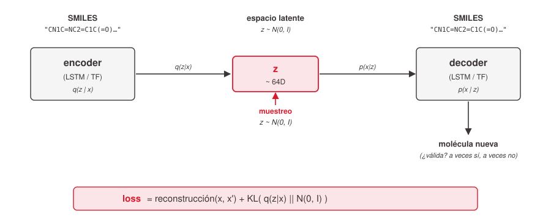
<!-- ascii-source:
            SMILES                      espacio latente                     SMILES
   "CN1C=NC2=C1C(=O)..."                  z ~ N(0, I)              "CN1C=NC2=C1C(=O)..."

        +-----------+                      +------+                     +-----------+
        |  encoder  |  ----------------->  |  z   |  ----------------- >|  decoder  |
        | (LSTM/    |   q(z|x)             | ~64D |       p(x|z)        |  (LSTM/   |
        |  TF)      |                      +------+                     |   TF)     |
        +-----------+                          ^                        +-----------+
                                               |
                                          muestreo:
                                          z ~ N(0, I)
                                               |
                                               v
                                       --> molécula nueva
                                       (¿válida? a veces sí, a veces no)

   loss = reconstrucción(x, x_hat) + KL( q(z|x) || N(0, I) )
-->
<!-- ascii-note:
intent: Classical VAE schema applied to SMILES — encoder maps a SMILES string to a latent point, decoder maps back. The KL term in the loss is what makes the latent distribution match N(0,I) so that ancestral sampling z~N(0,I) → decoder is meaningful. Note arrow showing sampling from N(0,I) returning to the decoder.
emphasize: Encoder and decoder boxes equal weight; the "z ~ 64D" box in the middle is the load-bearing artifact; the loss equation at the bottom is the only formula in the slide and should stand out.
labels: encoder label "q(z|x)", decoder label "p(x|z)"; bottom caption "loss = reconstrucción + KL( q(z|x) || N(0,I) )".
-->

⚠️ **Problema:** el latente del VAE casi nunca distribuye exactamente como `N(0,I)`. Tiene huecos, modos, regiones vacías. Muestrear ciegamente cae muchas veces en zonas donde el decoder produce **SMILES inválidos**.

### Sources

- `corpus/AIG4B-Clase-13-IA-Bio-Quimica.md.md` — sección *VAE de SMILES — el paradigma clásico (2018)*.
- `corpus/AIG4B-Clase-13-IA-Bio-Quimica-Practica-Resuelta.ipynb.md` — arquitectura VAE (cells 21–22), entrenamiento con free bits + KL annealing (cell 24), helper de muestreo (cell 25), métricas validez/unicidad/novedad (cells 26–27).

### Speaker notes

El VAE — Variational Autoencoder — es el paradigma clásico de generación molecular, alrededor de 2018. La idea es **aprender dos cosas en simultáneo**. Un encoder que toma un SMILES y lo mapea a un punto en un espacio latente continuo (típicamente ~64 dimensiones). Un decoder que toma un punto del latente y reconstruye un SMILES. Si entrenan ambos juntos con la pérdida correcta — reconstrucción + un término KL que empuja el latente a parecerse a una normal estándar — el modelo aprende una representación rica de la química. Una vez entrenado, **muestrear moléculas nuevas** es teóricamente trivial: tomamos un vector al azar de N(0,I), lo pasamos por el decoder, y sale una molécula. Si el VAE entrenó bien, esa muestra debería ser un SMILES válido y plausible. En la práctica, hay un problema clásico que el slide menciona: el latente del VAE casi nunca se distribuye exactamente como N(0,I). Tiene huecos (zonas que ningún ejemplo del training set ocupó), modos (regiones donde se acumulan ciertas familias químicas), y regiones vacías entre modos. Si muestreás ciegamente de la normal, **caés muchas veces en zonas donde el decoder no sabe generar nada coherente** — produce SMILES sintácticamente inválidos, o moléculas raras. En el Ejercicio 2 van a entrenar este VAE sobre un subset de **10.000 SMILES random de ZINC 250k** (el archivo estándar del repo `aspuru-guzik-group/chemical_vae`, filtrado a longitud 5–50). La arquitectura concreta: LSTM bidireccional encoder + LSTM autoregresivo decoder, latente de 64 dimensiones, char-level sobre el alfabeto SMILES. Dos técnicas estándar que van a usar para que entrene bien: **free bits** (asegura una cuota mínima de KL por dimensión latente, evita el "posterior collapse" — el problema clásico donde el decoder aprende a ignorar el latente) y **KL annealing** (rampa el peso del KL desde 0 al inicio del entrenamiento, para que el decoder aprenda a reconstruir antes de exigirle estructura del latente). Métricas que van a medir: **validez** (% parseables por RDKit, canonicalizadas), **unicidad** (% distintas entre las válidas), **novedad** (% no presentes en el train set canonicalizado). **GPU obligatoria en Colab** — con GPU tarda ~5–8 min, en CPU es ~1h. (~3.5 min).
---

## 3. Difusión latente

### Content

Misma idea que **Stable Diffusion (Clase 9)**: en vez de muestrear el latente ciegamente, entrenamos un **modelo de difusión sobre el latente del VAE**.

El difusor aprende a generar latentes que están en la **distribución real de los datos**, no en `N(0,I)` ingenua. Cuando muestreamos con difusión y decodificamos → caemos en zonas que el decoder sabe manejar → **validez sube**.

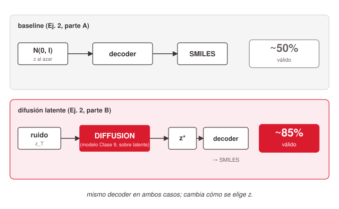
<!-- ascii-source:
   baseline (Ej. 2, parte A)             difusión latente (Ej. 2, parte B)

   N(0, I) ---> decoder ---> SMILES      ruido ---> [ DIFFUSION ] ---> z* ---> decoder ---> SMILES
   (z al azar)               (~50%      (z_T )      (mismo modelo                          (~85%
                              válido)               de Clase 9,                             válido)
                                                    sobre latente
                                                    de moléculas)

   mismo decoder en ambos casos;  cambia cómo se elige z.
-->
<!-- ascii-note:
intent: Two pipelines stacked vertically. Top: naive z~N(0,I) → decoder. Bottom: noise → diffusion model → z* → decoder. Same decoder in both. The validity percentages on the right are the punchline difference.
emphasize: The DIFFUSION box and the two validity numbers — those are the comparison the practice exercise materializes. The footer "mismo decoder; cambia cómo se elige z" is the conceptual takeaway.
labels: pipeline labels "baseline (Ej. 2, parte A)" / "difusión latente (Ej. 2, parte B)"; outputs "~50% válido" / "~85% válido"; footer "mismo decoder; cambia cómo se elige z".
-->

🎯 **El mismo patrón que AlphaFold 3:** cambia el dominio (moléculas vs estructuras 3D vs imágenes), **no** el método.

### Sources

- `corpus/AIG4B-Clase-13-IA-Bio-Quimica.md.md` — sección *Difusión latente — el paradigma actual*.
- `corpus/AIG4B-Clase-13-IA-Bio-Quimica-Practica-Resuelta.ipynb.md` — Ej. 2 parte B (cells 29–33): modelo de difusión sobre z, entrenamiento y muestreo comparativo.

### Speaker notes

El paradigma actual de generación molecular es difusión latente, y la idea es **exactamente la misma que Stable Diffusion** que vimos en Clase 9. Recordatorio rápido: en Stable Diffusion, la difusión no opera sobre los píxeles directamente (que sería caro) — opera sobre el espacio latente de un VAE de imágenes. Las imágenes generadas son el resultado de muestrear un latente con difusión y decodificarlo. Acá hacemos **exactamente lo mismo, con un VAE de moléculas**. El cambio respecto del baseline es chico de describir pero grande en resultados: en lugar de muestrear z ciegamente de N(0,I), entrenamos un modelo de difusión sobre el latente del VAE. El difusor aprende a generar latentes que están en la distribución real de los datos — los huecos y modos que el VAE dejó en su latente, el difusor los esquiva. Cuando muestreamos así y decodificamos, caemos en zonas que el decoder sabe manejar — la validez de los SMILES generados sube significativamente (numericamente la práctica suele ver ~50% → ~85%, los valores exactos dependen del entrenamiento). Mismo decoder, distinta forma de elegir z. En el Ejercicio 2, parte A entrenan el baseline (muestreo directo de N(0,I)); parte B entrenan el difusor sobre los latentes que el VAE ya aprendió. Comparan validez, unicidad y novedad de las moléculas generadas. El mensaje conceptual del slide — el callout final — es el mismo que dije en AF3: **cambia el dominio, no el método**. Difusión sobre imágenes, sobre estructuras 3D, sobre latentes moleculares. Las tres aplicaciones son el mismo paradigma. (~3.5 min).
---

## 4. Showcase: difusión en producción

### Content

La difusión sobre estructuras moleculares no es un experimento académico — ya está en pipelines reales:

- 🛠️ **RFdiffusion** (Baker lab, 2023) — diseña **proteínas de novo** desde cero con función deseada. Llevó a Baker al Nobel 2024.
- 🎯 **DiffDock** (MIT, 2023) — docking molecular: cómo se acopla un ligando a una proteína. Más rápido y preciso que métodos clásicos.
- 🧬 **AlphaFold 3** (2024) — módulo final de difusión, predice complejos proteína + ligando + ADN/ARN.

🎯 **Patrón claro:** *difusión + representación adecuada del dominio = nuevo estándar para problemas estructurales en biología y química.*

### Sources

- `corpus/AIG4B-Clase-13-IA-Bio-Quimica.md.md` — sección *Showcase: lo que ya se está haciendo en producción*.

### Speaker notes

Para cerrar la sección de generación, tres ejemplos concretos en producción. **RFdiffusion** (Baker lab, 2023) — modelo de difusión sobre **estructuras de proteínas** que diseña proteínas de novo, desde cero, con función deseada. Vos le decís "quiero una proteína que se una a este target", el modelo te devuelve una secuencia que se pliega a una estructura que cumple ese binding. Eso es lo que llevó a Baker al Nobel 2024 — fue su segundo modelo de difusión, en realidad (el primero fue una variante anterior), y a fines de 2023 ya estaba diseñando enzimas que funcionaban en wet lab. **DiffDock** (MIT, 2023) — difusión sobre el espacio de poses de docking, es decir, cómo un ligando se acopla a una proteína. Tradicionalmente esto se hace con métodos físicos (AutoDock, Vina) que son lentos y aproximados; DiffDock es más rápido y más preciso. Es el típico "Stable Diffusion del docking" — la analogía es directa. **AlphaFold 3** (2024) — ya lo vimos. Su módulo final es de difusión, y genera complejos proteína + ligando + ácido nucleico. **El patrón es claro:** todos los casos punteros de generación estructural en bio/química son difusión sobre la representación adecuada del dominio. El callout final lo deja escrito: **difusión + representación adecuada del dominio = nuevo estándar**. Vamos a cerrar la clase. (~2.5 min).
---

# 8. Cierre

**Goal of this section:** Cristalizar el patrón común detrás de los casos exitosos (las tres "patas": representación + arquitectura + datos) y mirar otros dominios moviéndose por la misma curva.
---

## 1. El patrón común

### Content

Todos los casos que vimos hoy — AlphaFold, ESMFold, AF3, RFdiffusion, DiffDock, GNNs sobre BBBP, difusión latente sobre moléculas — comparten la **misma receta**:

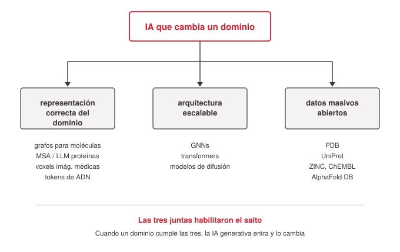
<!-- ascii-source:
              +----------------------------------+
              |     IA que cambia un dominio     |
              +-----------------+----------------+
                                |
              +------+----------+-----------+------+
              |                 |                  |
              v                 v                  v
   +-------------------+ +----------------+ +-------------------+
   |  representación   | |  arquitectura  | |  datos masivos    |
   |   correcta del    | |   escalable    | |     abiertos      |
   |    dominio        | |                | |                   |
   +-------------------+ +----------------+ +-------------------+

   grafos para moléc.    GNNs               PDB
   MSA / LLM proteínas   transformers       UniProt
   voxels imág. médicas  modelos difusión   ZINC, ChEMBL
   tokens de ADN                            AlphaFold DB
-->
<!-- ascii-note:
intent: Triangle/diamond diagram — three pillars that together enable an "IA que cambia un dominio". Each pillar has examples beneath it spanning multiple domains so the audience sees that the recipe generalizes.
emphasize: The three boxes are equal-weight peers (no hierarchy). The examples beneath each box are the proof-of-genericity — that's what should pop on the slide.
labels: top box "IA que cambia un dominio"; three pillars "representación correcta del dominio" / "arquitectura escalable" / "datos masivos abiertos"; example lists beneath each.
-->

🎯 **Las tres juntas habilitaron el salto.** Cuando un dominio nuevo cumple las tres, la IA generativa entra y lo cambia.

### Sources

- `corpus/AIG4B-Clase-13-IA-Bio-Quimica.md.md` — sección *El patrón común detrás de los casos exitosos*.

### Speaker notes

El cierre conceptual. Todo lo que vimos hoy — la lista entera del callout — comparten la misma receta de tres patas. **Pata uno: representación correcta del dominio.** Grafos para moléculas, MSA o LLM para proteínas, voxels para imágenes médicas, secuencias de tokens para ADN. La elección de cómo le damos los datos al modelo es la mitad del problema. Esa decisión a veces parece técnica pero es **el momento más importante** del diseño de un sistema de IA aplicado. **Pata dos: arquitectura escalable.** GNNs, transformers, modelos de difusión. Arquitecturas que aprovechan la estructura del dominio y escalan con compute y datos. Si la arquitectura no escala, el dominio se atasca aunque tengas buena representación. **Pata tres: datos masivos abiertos.** PDB, UniProt, ZINC, AlphaFold DB, ChEMBL. La parte que la academia y la industria llevan décadas construyendo, mucho antes de que llegara el deep learning. Sin esos datasets no hay AF2. El mensaje del callout es: **las tres juntas habilitaron el salto**. Cuando un dominio cumple las tres, la IA generativa entra y suele cambiarlo. Si uno mira un dominio nuevo y se pregunta "¿esto está por moverse?", checkar las tres patas es una primera evaluación bastante predictiva. (~3 min).
---

## 2. El límite — validación sigue obligatoria

### Content

Los modelos generan **candidatos** — la validación experimental sigue siendo necesaria.

- 🧪 **Predicción ≠ verdad biológica.** Una proteína predicha no es una proteína sintetizada y caracterizada.
- 📊 **Los modelos heredan los sesgos de los datos.** Familias raras en PDB → predicciones menos confiables.
- 🏥 **Aplicación clínica:** no se prescribe una droga porque una GNN dijo que sí. La IA filtra el embudo; el wet lab sigue mandando.

⚠️ **La IA es un acelerador, no una respuesta final.**

### Sources

- `corpus/AIG4B-Clase-13-IA-Bio-Quimica.md.md` — sección *Limitaciones y horizonte*.

### Speaker notes

Antes del cierre, un disclaimer honesto que vale la pena reforzar. Toda la clase fue sobre cómo la IA cambió biología y química — y es verdad. Pero conviene no quedarse con la versión triunfalista. Los modelos generan **candidatos**: estructuras predichas, moléculas propuestas, secuencias diseñadas. La validación experimental sigue siendo necesaria. Predicción **no es** verdad biológica. Una proteína predicha no es una proteína sintetizada y caracterizada en laboratorio. Los modelos también heredan los sesgos de los datos: si una familia de proteínas es rara en PDB (las membrana, por ejemplo, están sub-representadas porque son difíciles de cristalizar), las predicciones para esa familia serán menos confiables. En aplicaciones clínicas esto se vuelve crítico — nadie prescribe una droga porque una GNN dijo que sí. La IA filtra el embudo de drug discovery a millones más rápido, pero el wet lab sigue mandando antes de tocar un paciente. **La frase del callout** resume: la IA es un acelerador, no una respuesta final. Con esto vamos al mensaje final. (~2 min).
---

## 3. Otros dominios + mensaje final

### Content

Otros dominios moviéndose al mismo ritmo (mismo patrón, distinto dominio):

- 🌍 **Clima — GraphCast** (Google, 2023): precisión de modelos numéricos, 1000× más rápido.
- 🔬 **Materiales — GNoME** (Google, 2023): 2.2 millones de cristales nuevos estables.
- 🧬 **Single-cell genomics** — transformers sobre expresión génica para tipos celulares y enfermedades.

🎯 **Mensaje final.** La IA generativa dejó de ser un tema solo de lenguaje e imágenes. **Cuando hay buena representación, buena arquitectura y datos abiertos, entra al dominio que sea — y suele cambiarlo.** Biología, química, física, materiales: distintos puntos de la misma curva.

### Sources

- `corpus/AIG4B-Clase-13-IA-Bio-Quimica.md.md` — sección *Limitaciones y horizonte*, y *Mensaje final*.

### Speaker notes

Mirada al horizonte y cierre. Tres ejemplos rápidos de otros dominios moviéndose por la misma curva — cosas que no vimos hoy pero son parte del mismo movimiento. **GraphCast** (Google DeepMind, 2023) — predice clima global con precisión de modelos numéricos físicos, pero 1000× más rápido. Ya está en uso operacional en algunos servicios meteorológicos. **GNoME** (Google, 2023) — Graph Networks for Materials Exploration. Descubrió 2.2 millones de cristales nuevos estables, un crecimiento de órdenes de magnitud en el universo de materiales conocidos. Aplicaciones en baterías, semiconductores, catalizadores. **Single-cell genomics** — modelos tipo transformer sobre expresión génica, análogos a ESM-2 pero sobre células. Permite entender tipos celulares, transiciones de estado, y patología. **Mensaje final** (el callout). La IA generativa dejó de ser un tema solo de lenguaje e imágenes. Cuando hay buena representación, buena arquitectura y datos abiertos, entra al dominio que sea — y suele cambiarlo. Biología, química, física, materiales — distintos puntos de la misma curva. La curva no va a parar; lo que cambia es **qué dominio cae próximo**. Como ingenieros biomédicos, parte de su trabajo en los próximos años va a ser identificar esos dominios y construirlos. Con eso cerramos la teórica. Vamos a la práctica. (~3 min).
---

# Conclusions

## 1. Key takeaways

### Content

1. **El plegamiento se resolvió en 2020** con AlphaFold 2; el Nobel 2024 lo formalizó. Primera vez que el Nobel premia un método cuyo core es una red neuronal.
2. **La receta general:** representación correcta del dominio + arquitectura escalable + datos masivos abiertos. Las tres juntas habilitan el salto.
3. **La difusión generaliza.** El mismo paradigma de Stable Diffusion (Clase 9) sirve para estructuras 3D (AF3, RFdiffusion), docking (DiffDock) y latentes moleculares (lo que harán en el Ejercicio 2).
4. **Las GNNs son la herramienta natural para moléculas** — message passing captura el entorno local que define las propiedades químicas.
5. **AF no reemplaza el experimento** — filtra y prioriza. La IA no es una respuesta final, es un acelerador.

### Sources

- `corpus/AIG4B-Clase-13-IA-Bio-Quimica.md.md` — síntesis cruzando todas las secciones.

### Speaker notes

Resumen de los 5 takeaways clave. Los hago repaso rápido — si uno de estos no quedó claro, esta es la oportunidad. Uno: el plegamiento se resolvió en 2020 con AF2, formalizado con el Nobel 2024. Dos: la receta general que mencionamos en el cierre — representación + arquitectura + datos — las tres juntas. Tres: difusión generaliza, mismo paradigma de Clase 9 sobre nuevos dominios. Cuatro: GNNs son la herramienta para moléculas, message passing captura entorno local. Cinco: limitación honesta — AF no reemplaza el experimento. Es la lista que querría que se lleven anotada del cuaderno. (~2 min).
---

## 2. Práctica + Q&A

### Content

🧪 **Práctica (60 min restantes):**

- **Ej. 1 — GCN sobre BBBP** — featurización SMILES→grafo (PyG), entrenamiento, métricas (AUC/accuracy).
- **Ej. 2 — VAE de SMILES + difusión latente** — entrenan el VAE sobre ZINC 250k (subset 10k) con free bits + KL annealing; comparan muestreo baseline vs difusión latente.
- **Ej. 3 — ESMFold (bonus)** — predicen estructura de tres proteínas con el modelo de Meta vía HuggingFace.

⚙️ **Setup:** Google Colab → Runtime → Change runtime type → **GPU** (obligatoria para Ej. 2 y 3).
📂 **Notebook:** versión sin resolver — completan las celdas `=== SOLUCIÓN ===`.

### Sources

- `corpus/AIG4B-Clase-13-IA-Bio-Quimica-Practica-Resuelta.ipynb.md` — los tres ejercicios (esta es la versión resuelta, referencia interna; en clase reciben la versión sin resolver).

### Speaker notes

Cierre operacional. Quedan 60 minutos para la práctica. Tres ejercicios, todos corren en **Google Colab**. Lo primero: que cada uno vaya a Runtime → Change runtime type → GPU. El Ejercicio 1 corre razonablemente en CPU también, pero el 2 y el 3 sin GPU son imposibles. **Ej. 1 — GCN sobre BBBP:** bajan el dataset, lo featurizan SMILES→grafo PyG, entrenan una GCN simple, evalúan AUC y accuracy. Usa PyTorch Geometric. Es el ejercicio donde más manos van a poner. **Ej. 2 — VAE + difusión latente:** más denso, pero el código del VAE les viene casi entero. Lo importante conceptualmente es la comparación de validez, unicidad y novedad entre las dos formas de muestreo. El VAE entrena sobre un subset de 10k SMILES de ZINC 250k, char-level, latente 64-D. Con GPU tarda ~5–8 min el entrenamiento. **Ej. 3 — ESMFold (bonus):** bajan el modelo de Meta vía HuggingFace, le tiran tres proteínas, miran las estructuras + confidencias. Las tres proteínas del notebook están dimensionadas (no son monstruos de 1000 AAs); con GPU cada inferencia es de segundos. Sin GPU, minutos por proteína. **Importante:** la versión que reciben es **sin resolver** — tienen que completar las celdas marcadas `=== SOLUCIÓN ===` (y los bloques `<!-- SOLUCIÓN -->` en preguntas conceptuales). Si quedan trabados, levantan la mano. Q&A: los últimos 5 minutos quedan abiertos, o lo hacemos durante la práctica. (~1.5 min).
---

# Open questions

*(Todas las open questions iniciales se resolvieron durante Step 4: práctica corre en Google Colab con GPU obligatoria; notebook se distribuye en versión sin resolver; el VAE se entrena sobre ZINC 250k subset 10k — confirmado por inspección directa del notebook resuelto en `research/corpus/AIG4B-Clase-13-IA-Bio-Quimica-Practica-Resuelta.ipynb.md`. Speaker notes de Slide 7.2 y Conclusions Slide 2 actualizados.)*

# Cut material

- *(vacío por ahora — el `.md` teórica ya estaba bien escoped y no se descartó nada al pasar a slides; cualquier corte futuro va acá con una línea de motivo).*
